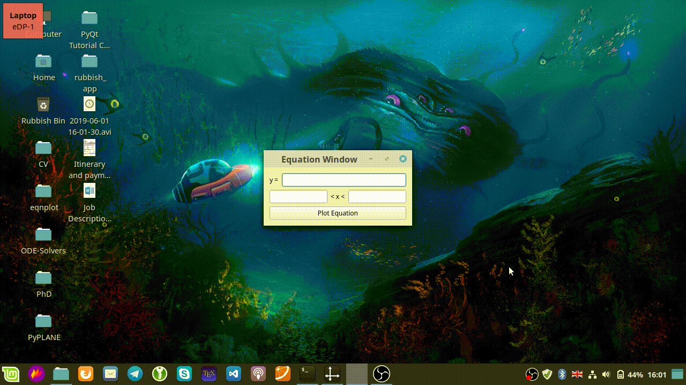

# eqnplot

Python / Qt5 app for plotting equations. Uses numpy and matplotlib on the backend.

## Demo

## Disclaimer
This is just me learning how this stuff is put together, so it's quite clunky and limited.
